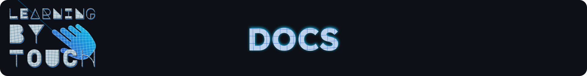

# Game Logic

**GameManager**

Steuert die gesamte Spiellogik der Anwendung. Bestimmt den Spielmodus (Singleplayer oder Multiplayer),
regelt die notwendige Genauigkeit für eine erfolgreiche Eingabe und verwaltet die Rundenanzahl pro Spieler.

Verwendete Komponenten:

-   `AvatarManager`
-   `PlayerManager`
-   `GameUIManager`
-   `CSVLogger`

Benötigte Assets:

-   `MuscleDatabase`: Ein `ScriptableObject`, das alle `MuscleData`-Objekte verwaltet.
-   `SubmitButton`: GameObject, das die Abgabe eines gezeichneten Muskels triggert.

 

---

 

**AvatarManager**

Verantwortlich für das Spawnen und Despawnen:

-   des **bemalbaren Avatars** im Singleplayer-Modus.
-   des Hilfs-Avatars, welcher den richtigen Muskel darstellt.

Benötigte Assets:

-   `hintAvatarPrefab`: Avatar zur Visualisierung des korrekten Muskels
-   `paintableAvatarPrefab`: Bemalbarer Avatar für den Spieler
-   `hintAvatarSpawnLocations`: Array möglicher Spawnpunkte für den Hilfs-Avatar
-   `paintableAvatarSpawnLocation`: Spawnposition für den bemalbaren Avatar

 

---

 

**PlayerManager**

Zuständig für das Management der Spieler während des Spiels. Dieses Skript weist Rollen zu, teleportiert Spieler beim Spielstart, verwaltet Referenztexturen und sorgt für das Zurücksetzen der Zeichenflächen.

Verwendete Komponenten:

-   `UIManager`
-   `NetworkPlayer`

 

---

 

**GameUIManager**

Verwaltet alle spielrelevanten UI-Abläufe wie Anleitungen, Rückmeldungen, Fortschrittsanzeigen sowie die Aktivierung des Submit-Buttons.

Verwendete Komponenten:

-   `UIManager`: Darstellende UI-Komponente für Text, Rollen, Feedback
-   `PresentationManager`: Steuert Audio und visuelle Schrittanleitungen
-   `XRSimpleInteractable`: Für Submit-Interaktion

 

---

 

**CSVLogger**

Speichert die unten stehenden Daten aus jeder Spielrunde in einer CSV-Datei.

| Spalte               | Bedeutung                       |
| -------------------- | ------------------------------- |
| Timestamp            | Datum & Uhrzeit der Abgabe      |
| Attempt              | Versuchsnummer (1–3)            |
| PainterName          | Name des zeichnenden Spielers   |
| CanvasName           | Name des Spielers mit Avatar    |
| MuscleIndex          | Index des dargestellten Muskels |
| MuscleGermanName     | Deutscher Muskelname            |
| MusclePixels         | Anzahl Pixel in Referenzmaske   |
| TotalPaintedPixels   | Gesamtzahl gezeichneter Pixel   |
| CorrectPaintedPixels | Überlappung mit Referenz        |
| OverpaintedPixels    | Falsch gezeichnete Pixel        |
| f1Accuracy           | F1-Score als Prozentwert        |

 

---

 

**AudioManager**

Spielt Instructions und Hintergrundsounds.

Benötigte Assets:

-   `AudioSource` für die Anweisungen
-   `AudioSource` für den Hintergrund Sound

 

---

 

**HintEnum**

Definiert SpawnLocations und Posen der Avatare für bestimmte Muskeln.

 

---

 

**SubmitButton**

Skript liegt auf dem Button für die Abgabe und triggert beim drücken die Funktion `ProcessSubmit()` im GameManager.

 

---

 

**UIManager**

Die Klasse kümmert sich um die alle UI Changes welche auf dem Client passieren.

Benötigte Assets:

-   `TMP_Text tvUI` um Informationen auf dem Hauptbildschrim anzuzeigen
-   `TMP_Text lockerUI` um Informationen auf dem UI im Startraum anzuzeigen
-   `TMP_Text roleUI` um die aktive Rolle anzuzeigen
-   `TMP_Text attemptUI` um die Anzahl der Versuche anzuzeigen
-   `TMP_Text correctUI` um die Anzahl der verbleibenden Muskeln anzuzeigen
-   `Button ClientButton` um im Startraum als Client zu starten
-   `Button ServerButton` um im Startraum als Server zu starten (ausgeblendet)

 
 
 
 

# Painting

**PaintManager**

Steuert den gesamten Mal-Workflow: Raycast vom Zeigefinger → UV-Berechnung → Vorschau/Stroke → Netzwerksync (über AvatarPaintable) → Feedback-Flash und PNG-Export (2048×2048).

Verwendete Komponenten:

- `SkinnedMeshRenderer`, temporärer MeshCollider (Raycast/UV)
- `RenderTexture` (Final/Preview/Feedback)
Materialien: `BrushShader` (Pinsel), `Hidden/BlitAdd` (Malen/Radieren)

Benötigte Assets:

- `referenceTexture` für Vergleich/Feedback

 

---

 

**AvatarPaintable**

Netzwerk-Adapter eines bemalbaren Avatars. Empfängt über RPCs Pinselstriche, repliziert sie an alle Clients und übergibt sie lokal an den `PaintManager`.

Verwendete Komponenten:

-   `PaintManager` 

 

---

 

**PaintStroke**

Datenpaket eines Pinselstrichs für das Netzwerk.

 

---

 

**PaintStats**

Speichert die Ergebnisse des Malvorgangs nach dem Vergleich mit einer Referenztextur. Wird vom PaintManager erstellt.

 
 
 
 

# Player

**NetworkPlayer**

Verwaltet die Verbindung eines Spielers mit seinem XR-Setup, dem Avatar-IK-System, Netzwerkverhalten und der UI. Reagiert auf Eingaben und synchronisiert Rollen, Texturen und Teleportation netzwerkweit.

Verwendete Komponenten:

-   `XROrigin` `XRInputModalityManager` für XR-Kontrolle und Tracking
-   `PaintManager` für Zeichenlogik des Fingers
-   `UIManager` `MenuManager` Lokale Benutzeroberfläche
-   `popUpCanvas` `TMP_Text` UI-Feedback für Rollen

 

---

 

**PhysicHands**

Diese Klasse ist zuständig um einen Pseudohaptischen Widerstand zu simulieren. Es liegt im XR Rig auf Left Hand Interaction Visual und Right Hand Interaction Visual.
Collider müssen den Hand Knochen zugewisen werden, ebenso wie ein weiterer Collider um die Physik ein-/auszuschalten.

 

---

 

**MenuManager**

Zuständig um dem Wrist Menü eines Clients funktionalität zuzuweisen, damit es:

-   Radiergummi togglen kann
-   Rechts/Linkshänder Modus togglen kann
-   Pinselgröße einstellen kann
-   Pinselfarbe einstellen kann

 

---

 

**IKFootSolver**

Die Komponente ist an dem Fuß IK des Avatars angebracht um Inverse Kinematik der Beine zu implementieren.

Quelle: [YouTube](https://www.youtube.com/watch?v=acMK93A-FSY)

 
 
 
 

# ScriptableObjects

**MuscleData**

Scriptable Object um einzelne Muskeln zu erstellen. Muskeln besitzen:

-   `Index` int um Muskel eindeutig zu identifizieren
-   `LatinName` String für den Lateinischen Namen eines Muskels
-   `GermanName` String für den Deutschen Namen eines Muskels
-   `function` String für die Funktion eines Muskels
-   `ReferenceTexture` Texture2D des Muskels
-   `spawnLocation` SpawnLocation für den HintAvatar
-   `pose` Pose für den HintAvatar

 

---

 

**MuscleDatabase**

Scriptable Object um einzelne Muskeln in einer Liste zu speichern.

 

---

 

**InstructionStep**

Scriptable Object um einzelne UI änderungen mit AudioClips zu synchronisieren. Dieses besitzt:

-   `text` String um einen Text anzeigen zu lassen
-   `audioClip` AudioClip um diesen mit dem Text abspielen zu lassen
-   `duration` float duration, basierend auf der Länge des AudioClips
-   `targetDisplay` UITarget um den Bildschirm auszuwählen wo der InstructionStep abgespielt werden soll

 

---

 

**InstructionList**

Scriptable Object um mehrere InstructionSteps in einer Liste zu speichern.

 
 
 
 

# Shader

Um die Mal- und Exportfunktion für diese Anwendung zu erstellen, sind drei custom shader benötigt worden.

### **Shader: Hidden/BlitAdd**

Dieser Shader ist für das **dynamische Malen und Radieren** auf den Texturen der Avatare zuständig. Er funktioniert wie eine digitale "Leinwand", auf die Pinselstriche aufgetragen oder entfernt werden.

-   **Funktion:** Mischt eine Pinsel-Textur (`_BrushTex`) mit einer Basis-Textur (`_BaseTex`). Abhängig vom `_EraseMode`-Parameter fügt er die Pinsel-Farbe hinzu (malt) oder macht den Bereich des Pinsels auf der Basistextur transparent (radiert).
-   **Verwendung:** Wird vom `PaintManager` (oder einem ähnlichen Skript) mittels `Graphics.Blit` oder `RenderTexture.Blit` verwendet, um die dynamische Zeichentextur des Avatars zu aktualisieren.

---

### **Shader: Custom/BrushShader**

Der `BrushShader` generiert die **Form und Eigenschaften des virtuellen Pinsels**, der zum Malen oder Radieren verwendet wird.

-   **Funktion:** Erzeugt eine 2D-Textur, die einen Pinselabdruck darstellt. Die Form (weich oder hart), Größe und Position werden über Shader-Eigenschaften gesteuert.
-   **Wichtige Parameter:**
    -   `_BrushSize`: Definiert den Radius des Pinsels.
    -   `_BrushUV`: Die UV-Koordinate, an der der Pinsel aufgetragen werden soll.
    -   `_UseHardBrush`: Bestimmt, ob der Pinsel harte Kanten hat oder weich ausgeblendet wird.
    -   `_BrushColor`: Die Farbe des Pinsels.
-   **Verwendung:** Wird intern vom `PaintManager` verwendet, um die `_BrushTex` für den `BlitAdd` Shader zu erzeugen.

---

### **Shader: Custom/CharacterShader**

Dieser Shader ist der **Haupt-Shader für die Darstellung der Avatare** und integriert alle Zeichenebenen sowie Feedback-Visualisierungen.

-   **Funktion:** Zeigt den Charakter-Avatar an und überlagert dabei verschiedene Texturen: die Basis-Textur des Avatars, die vom Spieler gemalte Textur, eine Vorschau-Textur (z.B. für den aktiven Pinsel) und eine Feedback-Textur (z.B. für korrekt/falsch gezeichnete Bereiche).
-   **Textur-Ebenen:**
    -   `_MainTex`: Die ursprüngliche Textur des Avatars (z.B. Hautfarbe, Kleidung).
    -   `_FinalTex`: Die finale, dauerhafte Zeichnung des Spielers.
    -   `_PreviewTex`: Eine temporäre Textur, die den aktuellen Pinselstrich anzeigt, bevor er auf `_FinalTex` übertragen wird.
    -   `_FeedbackTex`: Eine Textur, die visuelles Feedback liefert (z.B. Hervorhebung richtiger/falscher Bereiche).
-   **`_ShowFeedback`:** Steuert, ob das Feedback angezeigt wird und blendet in diesem Fall `_FinalTex` und `_PreviewTex` aus zugunsten des Feedbacks.
-   **Verwendung:** Wird auf den Materialien der 3D-Avatare angewendet.
