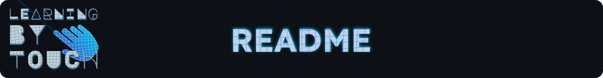
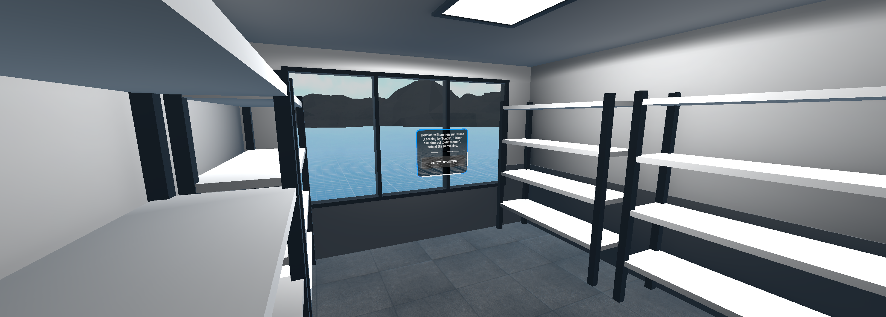
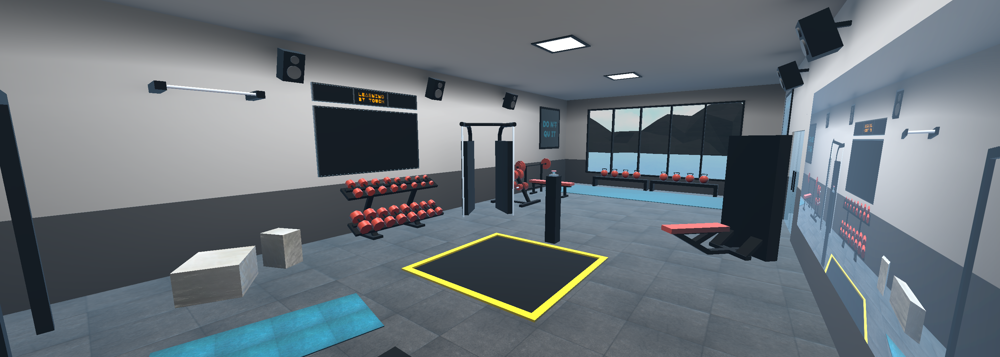
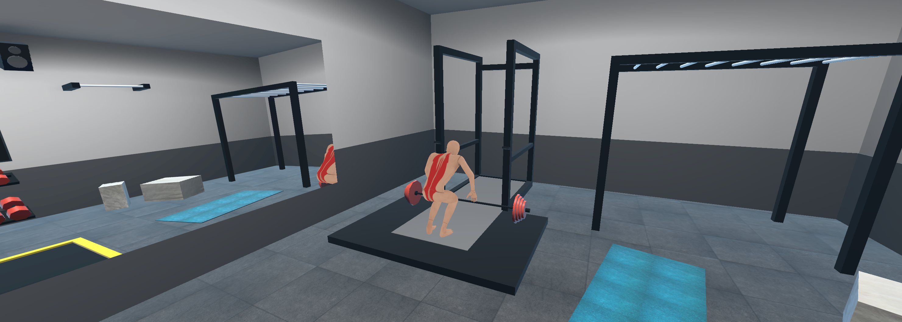

Learning by Touch wurde im Rahmen meiner Masterarbeit entwickelt und ist ein Prototyp, um Berührungen in Virtual Reality zu visualisieren.
Das übergeordnete Ziel ist dabei, die anatomische Muskelstruktur des Menschen besser kennenzulernen. 
Hierbei bekommen Nutzer lateinische Muskelbegriffe auf einem Fernseher angezeigt und müssen diese entweder an einem stationären Avatar (Einzelspieler) oder an einem Lernpartner (Mehrspieler) einzeichnen.
Mithilfe dieser Anwendung wurde der Einfluss zwischen Einzelspieler und Mehrspieler auf Nutzererlebnis, Lernmotivation und Lernerlebnis untersucht.

## Features

-   Handtracking via XR Interaction Toolkit und XR Hands
-   Pseudohaptischer Widerstand beim Berühren eines anderen Avatars oder GameObjects in der Szene
-   Anmalfunktion mittels Raycasting aus dem Zeigefinger
-   Exportfunktionalität des Gezeichneten in einem 2048 x 2048 px großen Bild im PNG-Format.
-   Multiplayer via Netcode for GameObjects
-   ~~Voice-Chat mittels Dissonance~~ (Aus Lizenzgründen wurde der Voice-Chat nicht veröffentlicht)

## Technisches

-   Unity-Version: 6000.0.29f1
-   Unity-Pakete: XR Interaction Toolkit 3.1.1, XR Hands 1.5.0, Netcode for GameObjects 2.4.2, ProBuilder 6.0.5
-   Getestet auf Meta Quest 2 und Meta Quest 3

## Struktur

Das Projekt funktioniert über eine Client/Server-Struktur. Der Server wird über den Unity-Editor gestartet, während sich die Clients (HMDs) darauf verbinden.

## Gameplay

Die Nutzer starten die Anwendung und spawnen in einem Warteraum. Drücken sie dort auf den Startknopf, werden sie in den Spielbereich teleportiert.
Anschließend müssen fünf verschiedene, zufällig ausgewählte Muskeln auf einen stationären Avatar (Einzelspieler) oder auf die andere Person (Mehrspieler) eingezeichnet werden.
Jeder Spieler hat drei Versuche, um einen Muskel korrekt einzuzeichnen. Zunächst werden der lateinische Muskelname und die dazugehörige Funktion angezeigt. Bei Fehlversuchen werden Hinweise gegeben (deutscher Muskelname, Hilfsavatar). Nach dem dritten Fehlversuch wird der Muskel übersprungen.

## Steuerung

Die Anwendung wurde so konzipiert, dass sie auf einem 2 x 2 Meter großen Spielfeld gespielt wird. Um ein optimales Erlebnis zu gewährleisten, sollte also ausreichend Platz vorhanden sein. Es werden keine Controller benötigt, um diese Anwendung zu spielen. Ein Nutzer bewegt sich physisch im Raum und kontrolliert seine Hände per Handtracking.
Über das Handgelenkmenü können die Pinselgröße, die Pinselfarbe, die Pinselhand und der Radiergummi eingestellt werden. Zum Zeichnen wird der linke oder rechte Zeigefinger verwendet.

## Anleitung

Zum Starten dieser Anwendung muss das Projekt geklont werden.
Anschließend muss die IPv4-Adresse des Computers herausgefunden werden, welcher als Server dient.
Die Adresse muss im GameObject *Network Manager* in dem Script *Unity Transport* unter *Address* eingefügt werden.
Darauffolgend kann ein Build der Applikation erstellt und auf die VR-Brillen übertragen werden.
Ist dies passiert muss der Play Mode in Unity gestartet werden, das GameObject *Dev* auf active gesetzt werden und der Button *Create* in der Game View gedrückt werden.
Über den *Game Manager* lässt sich der GameMode, also Einzelspieler oder Mehrspieler, im Script *GameManager* ändern. Das sollte passieren bevor sich der erste Spieler mit dem Server verbindet.

## Dokumentation

Eine Dokumentation dieses Projektes liegt [hier](DOCUMENTATION.md) vor.

## Lizenz

Der komplette Quellcode steht unter GPL-v3 (siehe `LICENSE`).
Dieses Repository veröffentlicht nur Quellcode – es werden keine Builds bereitgestellt.

## Screenshots

### Warteraum

### Spielbereich

### Hilfsavatar mit eingezeichnetem Muskel
